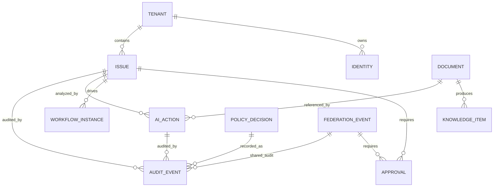

# LOGICAL_DATA_MODEL

## 目的

Logical Data Model は、AI Native Enterprise OS のMVPで扱う論理Entity、ID、Enum、参照関係を定義する。これは物理DB設計ではなく、実装前にObjectの意味と関係を固定するための設計成果物である。

## MVP Core Entities

| Entity | 役割 | 主Owner Service |
|---|---|---|
| Tenant | A社/B社/C社などの組織境界 | Authority / Federation |
| Identity | Human、AI Agent、Workflow、Partner | Authority |
| Issue | 企業活動の起点 | Object |
| Approval | 承認・稟議・CAB判断 | Workflow |
| WorkflowInstance | 状態遷移とSLA | Workflow |
| Document | 文書、添付、ファイル | Object / Knowledge |
| KnowledgeItem | Enterprise Memory上の知識 | Knowledge |
| AIAction | AI実行、Prompt、出力、説明 | AI Gateway |
| PolicyDecision | Policy評価結果 | Policy |
| AuditEvent | 改ざん防止証跡 | Audit |
| FederationEvent | Cross Tenant操作 | Federation |

## Logical Relationship

## ID規則

| Entity | ID Prefix | 例 |
|---|---|---|
| Tenant | ten | ten_a_company |
| Identity | idn | idn_user_001 |
| Issue | iss | iss_20260502_0001 |
| Approval | app | app_20260502_0001 |
| WorkflowInstance | wfi | wfi_20260502_0001 |
| Document | doc | doc_20260502_0001 |
| KnowledgeItem | kno | kno_20260502_0001 |
| AIAction | aia | aia_20260502_0001 |
| PolicyDecision | pde | pde_20260502_0001 |
| AuditEvent | aud | aud_20260502_0001 |
| FederationEvent | fed | fed_20260502_0001 |

## Core Enums

### Classification

| Value | 意味 |
|---|---|
| public | 公開可能 |
| internal | 社内限定 |
| confidential | 機密 |
| restricted | 高機密 |

### PolicyDecisionType

| Value | 意味 |
|---|---|
| allow | 許可 |
| deny | 禁止 |
| approval_required | 承認必須 |
| mask_required | Mask必須 |
| local_llm_required | Local LLM必須 |
| federation_review_required | Federation審査必須 |
| quarantine | 隔離 |

### ActorType

| Value | 意味 |
|---|---|
| human | 人間 |
| ai_agent | AI Agent |
| workflow | Workflow |
| system | System |
| external_partner | 外部Partner |

## Entity必須属性

| Entity | 必須属性 |
|---|---|
| Issue | issue_id, tenant_id, title, issue_type, priority, status, classification, owner_id |
| Approval | approval_id, target_object_id, requester_id, approver_id, decision, decision_reason |
| AIAction | ai_action_id, actor_id, model_provider, prompt_audit_ref, dlp_result_ref, reasoning_summary |
| AuditEvent | audit_event_id, actor_id, action, object_id, policy_result, hash_ref |
| FederationEvent | federation_event_id, source_tenant_id, target_tenant_id, shared_object_id, trust_level |

## 設計判断

- AI ActionはIssueの補助情報ではなく独立Entityとする
- Audit Eventはすべての重要Entityから参照される横断Entityとする
- Federation Eventは通常の共有フラグではなくCross Tenant操作Entityとする
- DocumentとKnowledgeItemを分け、ファイル実体と企業知識を混同しない

