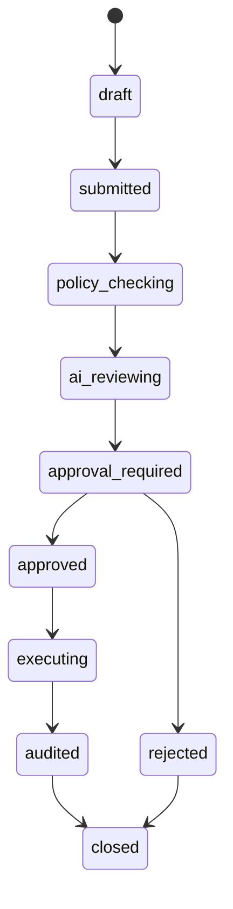
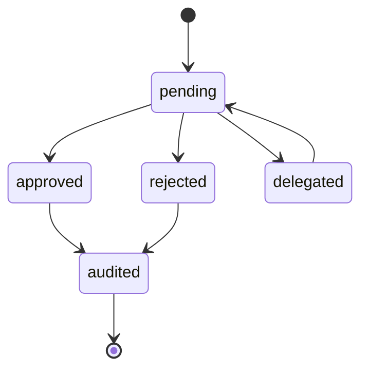
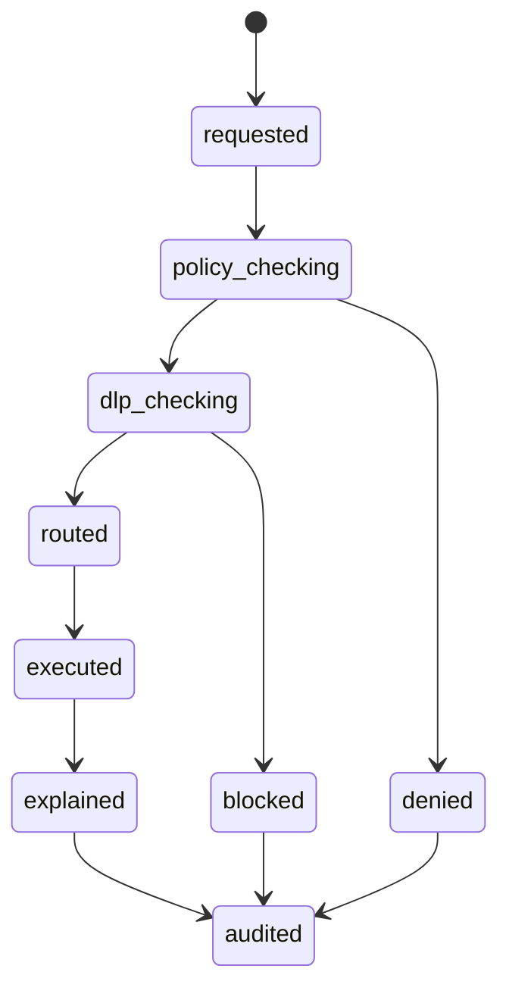
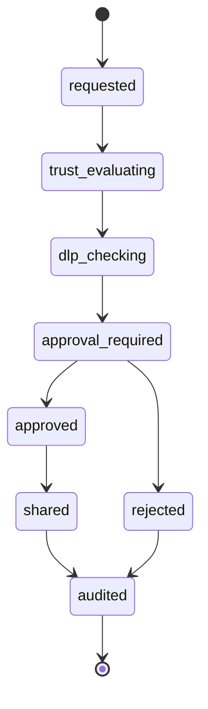

# STATE_MACHINE_SPECIFICATION

## 目的

State Machine Specification は、MVPで扱う主要Objectの状態遷移、禁止遷移、Policy/Audit挿入点を定義する。

## Issue State Machine

| State | 意味 | 必須処理 |
|---|---|---|
| draft | 下書き | なし |
| submitted | 提出済み | IssueCreated Audit |
| policy_checking | Policy判定中 | PolicyDecision生成 |
| ai_reviewing | AI分析中 | AI Gateway経由 |
| approval_required | 承認待ち | Approval作成 |
| approved | 承認済み | ApprovalDecided Audit |
| rejected | 却下 | 理由保存 |
| executing | 実行中 | Workflow Event |
| audited | 監査保存済み | AuditEvent確認 |
| closed | 完了 | Retention対象化 |

## Approval State Machine

## AI Action State Machine

## Federation Event State Machine

## 禁止遷移

| Object | 禁止遷移 | 理由 |
|---|---|---|
| Issue | submitted -> approved | Policy/AI/Approvalを迂回 |
| Approval | pending -> audited | 判断なしで監査完了不可 |
| AIAction | requested -> executed | Policy/DLP/Routeを迂回 |
| FederationEvent | requested -> shared | Trust/DLP/Approvalを迂回 |
| Document | registered -> external_ai_sent | DLPなし外部送信禁止 |

## 遷移時の横断要件

| 遷移種別 | Policy | Audit | UI表示 |
|---|---|---|---|
| 状態作成 | Authority | 必須 | Timeline |
| 承認判断 | Approval Policy | 必須 | Approval Panel |
| AI実行 | AI/DLP Policy | 必須 | AI Explainability |
| Federation共有 | Federation/DLP Policy | 必須 | Federation View |
| 完了 | Retention Policy | 必須 | Audit Timeline |

