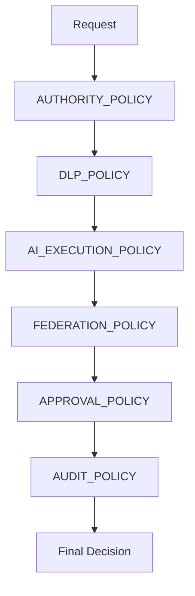

# G1_MINIMUM_POLICY_RULE_SET

## 目的

この文書は、GAP-003「Policy条件の最小セット」をCloseするためのMVP最小Policy Rule Setである。

## Gap Status

| Gap | Status | 判定 |
|---|---|---|
| GAP-003 Policy条件の最小セット | Closed | MVP実装に必要な最小Ruleを確定 |

## Policy設計原則

| 原則 | 内容 |
|---|---|
| Default Deny | 条件不明は許可しない |
| Audit Always | Policy DecisionはAudit対象 |
| Human Oversight | 高リスク操作は人間承認 |
| DLP Before AI | AI実行前にDLP判定 |
| Federation Review | Cross Tenant共有は審査必須 |

## AUTHORITY_POLICY

| Rule ID | 条件 | Decision |
|---|---|---|
| AUTH-001 | actor_type = human かつ tenant_id一致 | allow |
| AUTH-002 | actor_type = ai_agent かつ allowed_actionsに含まれる | allow |
| AUTH-003 | actor_type = ai_agent かつ production_change | approval_required |
| AUTH-004 | tenant_id不一致 かつ federation_eventなし | deny |
| AUTH-005 | actor不明 | deny |

## APPROVAL_POLICY

| Rule ID | 条件 | Decision |
|---|---|---|
| APP-001 | issue_type = approval | approval_required |
| APP-002 | classification in confidential/restricted | approval_required |
| APP-003 | risk_score >= 70 | approval_required |
| APP-004 | ai_agentが実行主体 かつ重要操作 | approval_required |
| APP-005 | approval_state = approved | allow |

## AI_EXECUTION_POLICY

| Rule ID | 条件 | Decision |
|---|---|---|
| AI-001 | classification = public | allow |
| AI-002 | classification = internal | allow |
| AI-003 | classification = confidential | local_llm_required |
| AI-004 | classification = restricted | deny |
| AI-005 | prompt_audit_refなし | deny |
| AI-006 | dlp_result_refなし | deny |

## DLP_POLICY

| Rule ID | 条件 | Decision |
|---|---|---|
| DLP-001 | classification = public | allow |
| DLP-002 | classification = internal かつ tenant内利用 | allow |
| DLP-003 | classification = confidential かつ外部送信 | mask_required |
| DLP-004 | classification = restricted かつ外部送信 | deny |
| DLP-005 | DLP未判定 | quarantine |

## FEDERATION_POLICY

| Rule ID | 条件 | Decision |
|---|---|---|
| FED-001 | source_tenant = target_tenant | allow |
| FED-002 | Cross Tenant かつ classification = public | allow |
| FED-003 | Cross Tenant かつ classification = internal | federation_review_required |
| FED-004 | Cross Tenant かつ classification = confidential | approval_required |
| FED-005 | Cross Tenant かつ classification = restricted | deny |
| FED-006 | trust_level未評価 | federation_review_required |

## AUDIT_POLICY

| Rule ID | 条件 | Decision |
|---|---|---|
| AUD-001 | 状態変更 | audit_required |
| AUD-002 | AI実行 | audit_required |
| AUD-003 | 承認判断 | audit_required |
| AUD-004 | Cross Tenant操作 | audit_required |
| AUD-005 | Policy deny | audit_required |

## Policy評価順

## 設計判断

- MVPでは複雑なPolicy言語を定義しない。
- Rule Setは人間がレビューできる表形式を正とする。
- `deny`、`approval_required`、`local_llm_required` は `allow` より優先する。
- Policy Decisionは必ずAudit Eventと紐づける。

