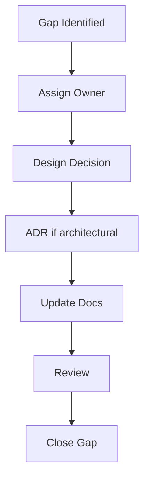

# GAP_CLOSURE_PLAN

## 目的

Gap Closure Plan は、実装開始前に残っている未確定事項、設計不足、レビューでの確認事項を整理し、解消順序を定義する。

## Gap Priority

| 優先度 | 意味 |
|---|---|
| G1 | 実装開始前に必ず解消 |
| G2 | MVP実装中の初期Sprintで解消 |
| G3 | Pilot前に解消 |
| G4 | 将来拡張 |

## G1: 実装開始前に解消すべきGap

| ID | Gap | 理由 | Closure | Status |
|---|---|---|---|---|
| GAP-001 | ID採番規則の詳細 | Entity参照とAudit追跡の基礎 | `G1_ID_ENUM_FINALIZATION.md` | Closed |
| GAP-002 | Enum最終一覧 | API/Data Contractの安定化 | `G1_ID_ENUM_FINALIZATION.md` | Closed |
| GAP-003 | Policy条件の最小セット | Governance Firstの実装単位 | `G1_MINIMUM_POLICY_RULE_SET.md` | Closed |
| GAP-004 | Audit Event必須属性 | 監査の信頼性 | `G1_AUDIT_EVENT_SCHEMA_FINALIZATION.md` | Closed |
| GAP-005 | MVP画面項目の最小セット | Wireframeから実装へ移るため | `G1_MVP_SCREEN_FIELD_LIST.md` | Closed |

## G2: MVP初期で解消すべきGap

| ID | Gap | 理由 | Closure |
|---|---|---|---|
| GAP-006 | External IdP属性Mapping | Federation Authに必要 | AD/Entra/LDAPの属性対応を定義 |
| GAP-007 | DLP Mask表現 | Confidential処理に必要 | mask_required時の表示・保存方針 |
| GAP-008 | Explainability詳細粒度 | AI説明の品質に影響 | reasoning_summary、source、confidenceの表示粒度 |
| GAP-009 | Retention既定値 | Audit/Document保管に必要 | MVP既定Retentionを定義 |

## G3: Pilot前に解消すべきGap

| ID | Gap | 理由 | Closure |
|---|---|---|---|
| GAP-010 | Pilotデータセット | 検証現実性 | A社/B社/C社の仮想データを用意 |
| GAP-011 | Pilot評価票 | 合否判定 | Scenario別の評価シートを作る |
| GAP-012 | Security Review観点 | Pilot安全性 | Threat Modelに基づくレビュー表を作る |

## Closure Flow



## Gap Closure原則

- Gapは実装中に曖昧なまま吸収しない
- Architectureに影響するGapはADR化する
- Security、AI、Federation、AuditのGapはP1扱いにする
- Closure後は関連文書を更新する

## 現在のGap Closure判定

```text
G1 Status: Closed
Readiness: Ready for MVP Implementation Planning
Coding: Not Yet
Next: Sprint Planning / ADR Signoff / Test Mapping
```
