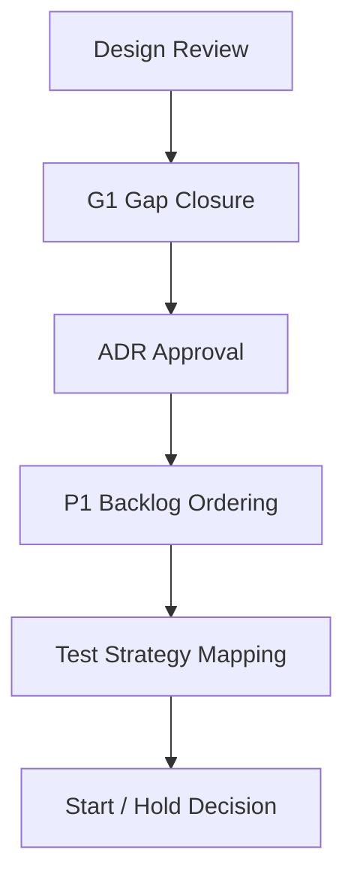

# IMPLEMENTATION_START_CRITERIA

## 目的

Implementation Start Criteria は、実装を開始してよい条件、開始してはいけない条件、最初に着手すべきP1 Backlogを明文化する。

## Start Decision

```text
Current Decision: Coding Start Ready, Pending User Approval
Reason:
- G1 GapはClosed。
- ADR Signoff、Sprint計画、Backlog-Test対応表、G2 Gap割当は完了。
- 実装開始はユーザー承認後に行う。
```

## 実装開始してよい条件

| 条件 | 必須 |
|---|---|
| Design Review ChecklistがPassまたはAccepted Risk | Yes |
| G1 GapがClose済み | Yes |
| MVP ReadinessがReady for MVP Implementation Planning以上 | Yes |
| ADR-001からADR-007が承認済み | Yes |
| P1 Backlogの順序が確定 | Yes |
| Test StrategyがBacklogに接続済み | Yes |
| Non Goals GuardがPass | Yes |
| User Approval for Coding | Yes |

## 実装開始してはいけない条件

| 条件 | 理由 |
|---|---|
| Direct AI Access経路が残る | AI Governance違反 |
| Audit Event必須属性が未確定 | 監査不能 |
| Tenant境界が曖昧 | Federation崩壊 |
| Approval bypassが可能 | Governance First違反 |
| MVP ScopeにERP/ITSM全体が混入 | 巨大化 |
| P1 BacklogがAcceptanceと未接続 | 実装目的が曖昧 |

## 最初に着手すべきP1 Backlog順

| 順序 | Backlog | 理由 |
|---:|---|---|
| 1 | BL-001 Tenant / Identity基盤の最小設計 | 全Objectの境界になる |
| 2 | BL-004 Policy Decision MVP | Governance Firstの基礎 |
| 3 | BL-005 Audit Timeline MVP | 証跡基盤を先に置く |
| 4 | BL-002 Issue Object MVP | 企業活動の起点 |
| 5 | BL-003 Approval Workflow MVP | 承認文化の核 |
| 6 | BL-007 Document Classification MVP | DLP入口 |
| 7 | BL-006 AI Gateway MVP | AI統制 |
| 8 | BL-008 Federation Event MVP | Cross Tenant操作 |
| 9 | BL-010 Dashboard MVP | 状態可視化 |

## 実装開始直前レビュー



## 最終判断

```text
Recommended Next Action:
1. Ask for user approval to start coding
2. If approved, begin Sprint 0 Implementation
3. If not approved, further split Sprint 0 issue details
```
