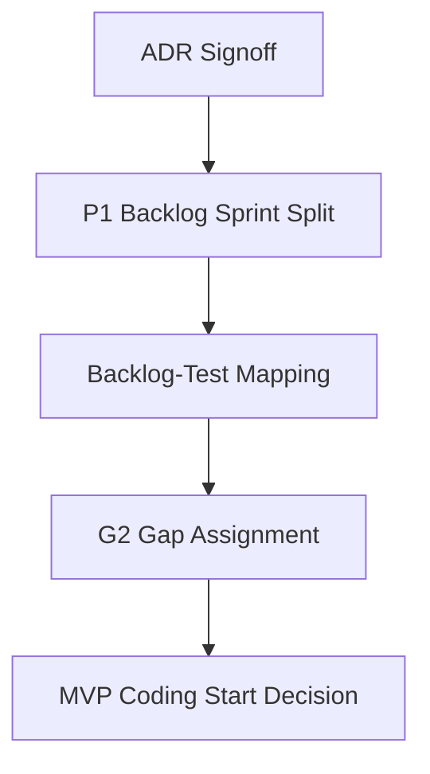

# MVP_IMPLEMENTATION_PLANNING

## 目的

MVP Implementation Planning は、設計完了後に実装へ入る直前の作業分解を定義する。ここではコードを書かず、ADR承認、Sprint分割、Backlog-Test対応、G2 Gap割当、実装開始判断を整理する。

## Planning Status

```text
Phase: MVP Implementation Planning
G1 Gap: Closed
Readiness: Ready for MVP Implementation Planning
Coding: Not Yet
Target Decision: Coding Start Ready, Pending User Approval
```

## 実装直前の流れ



## 成果物

| 順序 | 成果物 | 目的 |
|---:|---|---|
| 1 | `ADR_SIGNOFF.md` | ADR-001からADR-007を承認状態に固定 |
| 2 | `P1_BACKLOG_SPRINT_SPLIT.md` | P1/P2 BacklogをSprint 0/1/2へ分割 |
| 3 | `BACKLOG_TEST_MAPPING.md` | Backlogごとの検証観点を接続 |
| 4 | `G2_GAP_ASSIGNMENT.md` | G2 Gapを初期Sprintへ割当 |
| 5 | `MVP_CODING_START_DECISION.md` | 実装開始可否を明文化 |

## Planning原則

- 実装開始前に、Policy、Audit、AI Gateway、Federation境界をBacklogへ接続する。
- Sprint 0は土台作りであり、機能拡張を入れない。
- Coding Startはユーザー承認後にのみ行う。
- Direct AI Access、Audit省略、Tenant境界省略は開始禁止条件とする。

