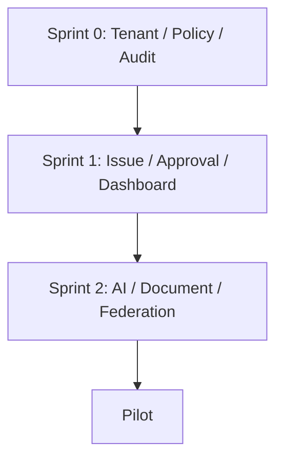

# P1_BACKLOG_SPRINT_SPLIT

## 目的

P1 Backlog Sprint Split は、MVP実装候補をSprint 0 / Sprint 1 / Sprint 2へ分割し、実装順序と依存関係を固定する。

## Sprint方針

| Sprint | 目的 |
|---|---|
| Sprint 0 | Kernel / Guardrail / Foundation |
| Sprint 1 | Issue + Approval + Auditの業務核 |
| Sprint 2 | AI Gateway + Document + Federation + Dashboard |

## Sprint 0: Kernel Foundation

| Backlog | Title | 理由 |
|---|---|---|
| BL-001 | Tenant / Identity基盤の最小設計 | すべてのObject境界 |
| BL-004 | Policy Decision MVP | Governance Firstの実体 |
| BL-005 | Audit Timeline MVP | 証跡基盤 |
| BL-012 | Non Goals Guard Review | Scope逸脱防止 |
| BL-013 | Policy Test Matrix実行準備 | 統制検証の土台 |

## Sprint 1: Enterprise Activity Core

| Backlog | Title | 理由 |
|---|---|---|
| BL-002 | Issue Object MVP | 企業活動の起点 |
| BL-003 | Approval Workflow MVP | 承認文化の核 |
| BL-010 | Dashboard MVP | 状態可視化の入口 |

## Sprint 2: AI / Document / Federation

| Backlog | Title | 理由 |
|---|---|---|
| BL-007 | Document Classification MVP | DLP入口 |
| BL-006 | AI Gateway MVP | Direct AI Access禁止 |
| BL-009 | AI Explainability View | AI Black Box防止 |
| BL-008 | Federation Event MVP | Cross Tenant操作 |
| BL-011 | Knowledge Lineage MVP | Knowledge信頼性 |

## Pilot候補

| Backlog | Title | 扱い |
|---|---|---|
| BL-014 | Teams/Mail Issue化Pilot | Pilot準備 |
| BL-015 | Federation Dashboard改善 | Pilot改善 |
| BL-016 | Audit Search改善 | Pilot改善 |

## Sprint依存関係



## 実装順序判断

```text
Start Order:
1. BL-001
2. BL-004
3. BL-005
4. BL-012
5. BL-013
6. BL-002
7. BL-003
8. BL-010
9. BL-007
10. BL-006
11. BL-009
12. BL-008
13. BL-011
```

