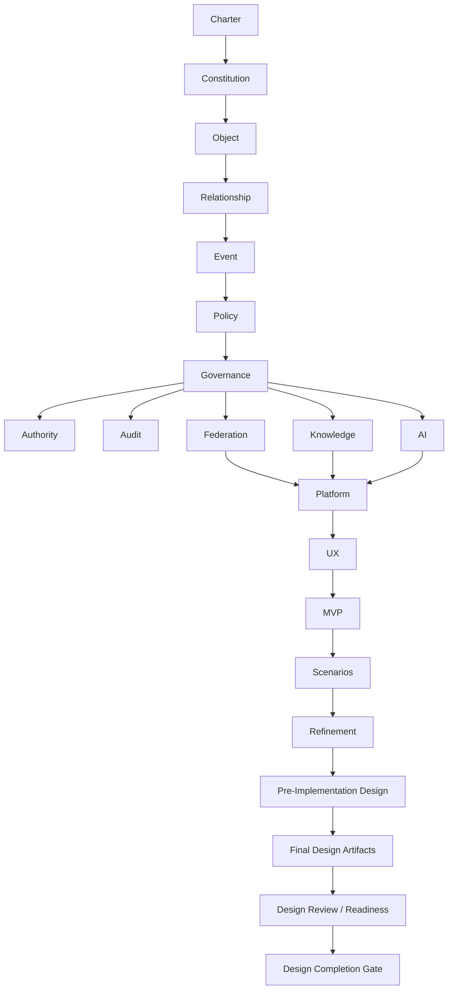

# DOCUMENTATION_MAP

## 目的

この文書は、Enterprise OS Blueprint全体の読み順、依存関係、責務境界を示す設計地図である。

## Canonical Sources（正本 / Single Source of Truth）

CLAUDE.md §16「単一の真実を持つ」に基づき、各領域の正本を以下に固定する。重複コピーは正本ではない。

| 領域         | 正本 (canonical)                                    | 備考                                                                                                                                                                                  |
| ------------ | --------------------------------------------------- | ------------------------------------------------------------------------------------------------------------------------------------------------------------------------------------- |
| 設計文書     | `docs/`（本ディレクトリ, version-controlled）       | リポジトリ直下の `docs/` が唯一の正本。`AI統制型 …開発プロジェクト/` 配下の同名コピーは過去の配布物であり非正本（`.gitignore` 済み）。原企画書は `docs/PROJECT_BRIEF.md` として保全。 |
| Web UI       | `web/`（Next.js 14, JWT + httpOnly session, :3000） | 本番フロントエンドの正本。`web_ui_server.py`（:3002, no-auth）は **DEPRECATED** な dev/demo 専用であり新規機能を載せない。                                                            |
| 運用ポリシー | `CLAUDE.md`（リポジトリ直下）                       | ClaudeOS v9.0 のプロジェクト正本。`AGENTS.md` は Codex 向けミラー。                                                                                                                   |
| 実行状態     | `state.json`                                        | KPI / phase / warnings の短期状態。                                                                                                                                                   |

## 推奨読み順

| 順序 | 文書                                                               | 目的                    |
| ---: | ------------------------------------------------------------------ | ----------------------- |
|    1 | `01_Constitution/ENTERPRISE_OS_CHARTER.md`                         | 存在目的                |
|    2 | `01_Constitution/ENTERPRISE_CONSTITUTION.md`                       | 最高規程                |
|    3 | `00_Object_Policy_Kernel/OBJECT_MODEL.md`                          | 企業活動の最小単位      |
|    4 | `00_Object_Policy_Kernel/RELATIONSHIP_MODEL.md`                    | Object関係              |
|    5 | `00_Object_Policy_Kernel/EVENT_MODEL.md`                           | 状態変化                |
|    6 | `00_Object_Policy_Kernel/POLICY_ENGINE_MODEL.md`                   | 判断Kernel              |
|    7 | `01_Constitution/GOVERNANCE_MODEL.md`                              | 統制全体                |
|    8 | `01_Constitution/AUTHORITY_MODEL.md`                               | 権限                    |
|    9 | `01_Constitution/AUDIT_MODEL.md`                                   | 監査                    |
|   10 | `02_Federation/FEDERATION_MODEL.md`                                | A社/B社/C社連携         |
|   11 | `03_Enterprise_Knowledge/KNOWLEDGE_GRAPH_MODEL.md`                 | Enterprise Memory       |
|   12 | `04_AI_Governance/AI_GATEWAY_MODEL.md`                             | AI統制                  |
|   13 | `05_Platform/PLATFORM_ARCHITECTURE.md`                             | 技術基盤方針            |
|   14 | `06_UX_UI/UX_CONSTITUTION.md`                                      | Enterprise Control Room |
|   15 | `07_MVP/MVP_SCOPE.md`                                              | 最初の実証範囲          |
|   16 | `08_Design_Scenarios`                                              | 代表業務シナリオ        |
|   17 | `09_Design_Refinement/DOMAIN_BOUNDARY_MODEL.md`                    | Domain責務境界          |
|   18 | `09_Design_Refinement/DATA_CONTRACT_MODEL.md`                      | Object契約              |
|   19 | `09_Design_Refinement/SECURITY_THREAT_MODEL.md`                    | 脅威モデル              |
|   20 | `09_Design_Refinement/MVP_SCREEN_FLOW_MODEL.md`                    | MVP画面遷移             |
|   21 | `09_Design_Refinement/MVP_ACCEPTANCE_CRITERIA.md`                  | MVP受け入れ条件         |
|   22 | `10_Pre_Implementation_Design/API_CONTRACT_DETAIL.md`              | API責務契約             |
|   23 | `10_Pre_Implementation_Design/SERVICE_RESPONSIBILITY_MODEL.md`     | Service責務境界         |
|   24 | `10_Pre_Implementation_Design/INFORMATION_ARCHITECTURE.md`         | 情報設計                |
|   25 | `10_Pre_Implementation_Design/TRACEABILITY_MATRIX.md`              | 原則からMVPへの追跡     |
|   26 | `10_Pre_Implementation_Design/MVP_PILOT_PLAN.md`                   | Pilot検証計画           |
|   27 | `11_Final_Design_Artifacts/LOGICAL_DATA_MODEL.md`                  | 論理Data Model          |
|   28 | `11_Final_Design_Artifacts/STATE_MACHINE_SPECIFICATION.md`         | 状態遷移仕様            |
|   29 | `11_Final_Design_Artifacts/WIREFRAME_SPECIFICATION.md`             | 画面ワイヤー仕様        |
|   30 | `11_Final_Design_Artifacts/TEST_STRATEGY.md`                       | テスト戦略              |
|   31 | `11_Final_Design_Artifacts/IMPLEMENTATION_BACKLOG.md`              | 実装Backlog候補         |
|   32 | `12_Design_Review_Readiness/DESIGN_REVIEW_CHECKLIST.md`            | 設計レビュー            |
|   33 | `12_Design_Review_Readiness/GAP_CLOSURE_PLAN.md`                   | Gap解消計画             |
|   34 | `12_Design_Review_Readiness/MVP_READINESS_ASSESSMENT.md`           | MVP実装可否判定         |
|   35 | `12_Design_Review_Readiness/ARCHITECTURE_DECISION_RECORDS.md`      | ADR                     |
|   36 | `12_Design_Review_Readiness/IMPLEMENTATION_START_CRITERIA.md`      | 実装開始条件            |
|   37 | `12_Design_Review_Readiness/MVP_IMPLEMENTATION_PLANNING.md`        | MVP実装直前計画         |
|   38 | `12_Design_Review_Readiness/ADR_SIGNOFF.md`                        | ADR Signoff             |
|   39 | `12_Design_Review_Readiness/P1_BACKLOG_SPRINT_SPLIT.md`            | Sprint分割              |
|   40 | `12_Design_Review_Readiness/BACKLOG_TEST_MAPPING.md`               | Backlog-Test対応        |
|   41 | `12_Design_Review_Readiness/G2_GAP_ASSIGNMENT.md`                  | G2 Gap割当              |
|   42 | `12_Design_Review_Readiness/MVP_CODING_START_DECISION.md`          | Coding開始判定          |
|   43 | `12_Design_Review_Readiness/MVP_IMPLEMENTATION_PLANNING_REPORT.md` | 実装直前計画報告        |

## アーカイブ（参考資料）

正式設計の正本ではないが、構想初期の原典ノートを下記に保管している。設計動機や Phase 全体像の俯瞰として参照する。

| 文書                                                                     | 目的                                           |
| ------------------------------------------------------------------------ | ---------------------------------------------- |
| `_origin/INDEX.md`                                                       | 原典ノート群の総目次と対応する正式設計のリンク |
| `_origin/00_VISION_ENTERPRISE_OS.md`                                     | Enterprise OS 全体ビジョンの原典               |
| `_origin/01_ARCHITECTURE_PHASES_OVERVIEW.md`                             | 全 Phase 俯瞰の原典                            |
| `_origin/02_PHASE1_CONSTITUTION_LAYER.md` 〜 `_origin/10_PHASE10_MVP.md` | Phase 1〜10 の原典ナラティブ                   |

## 依存関係

## 責務境界

| 文書群                    | 責務                                                               |
| ------------------------- | ------------------------------------------------------------------ |
| Constitution              | 何を許可し、何を禁止するか                                         |
| Object / Policy Kernel    | 企業活動をどう表現し、どう判定するか                               |
| Federation                | 組織境界をどう維持しながら連携するか                               |
| Knowledge                 | 企業知識をどう蓄積、保護、説明に使うか                             |
| AI Governance             | AIをどう統制し、監査し、説明可能にするか                           |
| Platform                  | どの基盤構造で動かすか                                             |
| UX / UI                   | 状態、監査、AI説明をどう見せるか                                   |
| MVP                       | 最初に何を検証するか                                               |
| Design Scenarios          | 代表的な業務・AI・Federationシナリオ                               |
| Design Refinement         | 実装前に必要なDomain、Data、Security、画面、Acceptanceの精密化     |
| Pre-Implementation Design | 実装設計へ移る直前のAPI、Service、IA、Traceability、Pilot計画      |
| Final Design Artifacts    | 実装前にレビュー可能な論理Data、状態遷移、Wireframe、Test、Backlog |
| Design Review / Readiness | 設計レビュー、Gap解消、ADR、実装開始可否判定                       |

## 実装前に読む文書

| 領域            | 文書                                                           |
| --------------- | -------------------------------------------------------------- |
| Domain          | `09_Design_Refinement/DOMAIN_BOUNDARY_MODEL.md`                |
| Data            | `09_Design_Refinement/DATA_CONTRACT_MODEL.md`                  |
| Security        | `09_Design_Refinement/SECURITY_THREAT_MODEL.md`                |
| UX Flow         | `09_Design_Refinement/MVP_SCREEN_FLOW_MODEL.md`                |
| Acceptance      | `09_Design_Refinement/MVP_ACCEPTANCE_CRITERIA.md`              |
| API Contract    | `10_Pre_Implementation_Design/API_CONTRACT_DETAIL.md`          |
| Service         | `10_Pre_Implementation_Design/SERVICE_RESPONSIBILITY_MODEL.md` |
| IA              | `10_Pre_Implementation_Design/INFORMATION_ARCHITECTURE.md`     |
| Traceability    | `10_Pre_Implementation_Design/TRACEABILITY_MATRIX.md`          |
| Pilot           | `10_Pre_Implementation_Design/MVP_PILOT_PLAN.md`               |
| Logical Data    | `11_Final_Design_Artifacts/LOGICAL_DATA_MODEL.md`              |
| State Machine   | `11_Final_Design_Artifacts/STATE_MACHINE_SPECIFICATION.md`     |
| Wireframe       | `11_Final_Design_Artifacts/WIREFRAME_SPECIFICATION.md`         |
| Test            | `11_Final_Design_Artifacts/TEST_STRATEGY.md`                   |
| Backlog         | `11_Final_Design_Artifacts/IMPLEMENTATION_BACKLOG.md`          |
| Review          | `12_Design_Review_Readiness/DESIGN_REVIEW_CHECKLIST.md`        |
| Gap             | `12_Design_Review_Readiness/GAP_CLOSURE_PLAN.md`               |
| Readiness       | `12_Design_Review_Readiness/MVP_READINESS_ASSESSMENT.md`       |
| ADR             | `12_Design_Review_Readiness/ARCHITECTURE_DECISION_RECORDS.md`  |
| Start Criteria  | `12_Design_Review_Readiness/IMPLEMENTATION_START_CRITERIA.md`  |
| Planning        | `12_Design_Review_Readiness/MVP_IMPLEMENTATION_PLANNING.md`    |
| Sprint Split    | `12_Design_Review_Readiness/P1_BACKLOG_SPRINT_SPLIT.md`        |
| Test Mapping    | `12_Design_Review_Readiness/BACKLOG_TEST_MAPPING.md`           |
| Coding Decision | `12_Design_Review_Readiness/MVP_CODING_START_DECISION.md`      |
