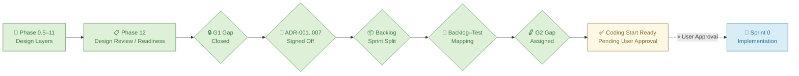
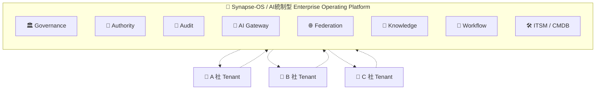
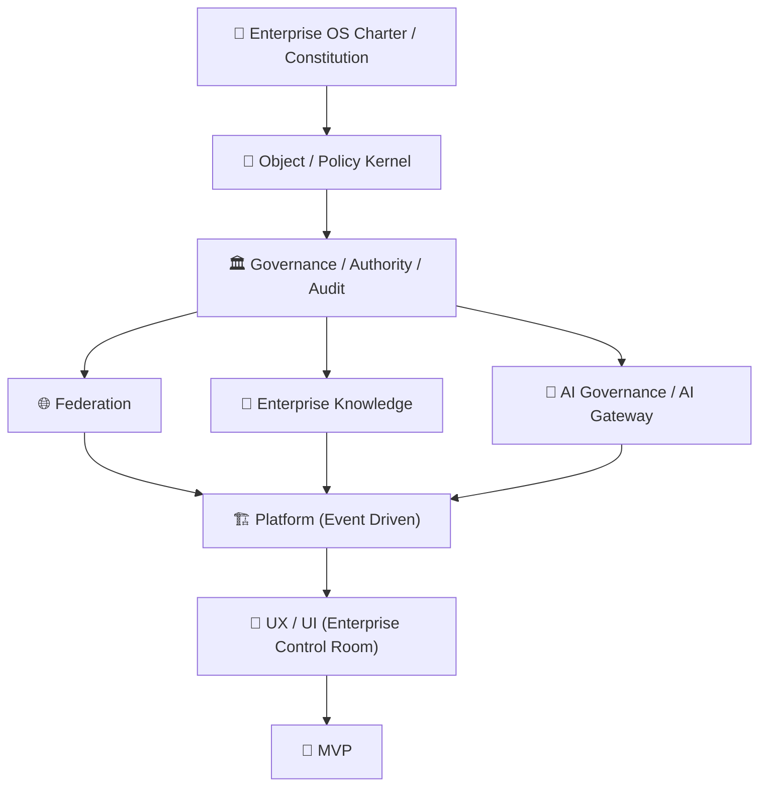
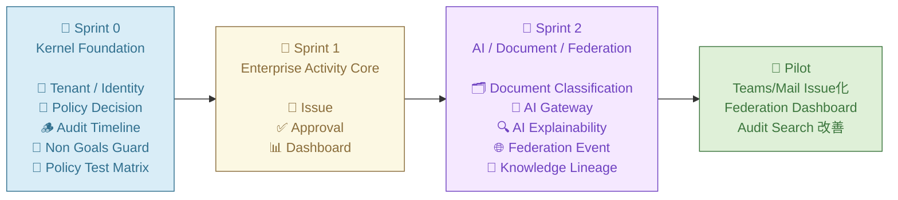
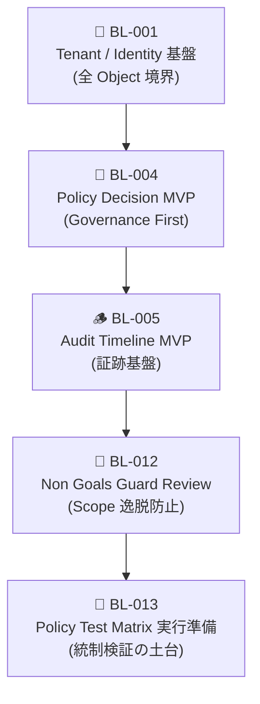
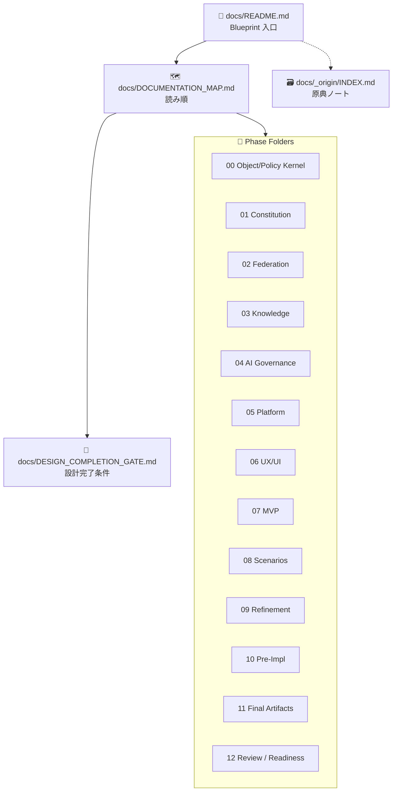
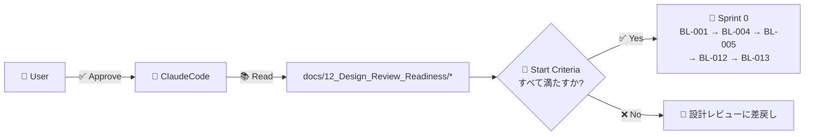
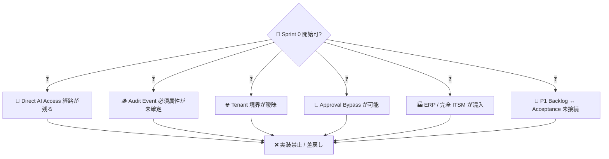

# 🧠 Synapse-OS

### 🏛 AI統制型 Enterprise Operating Platform

> 🌍 **A 社 / B 社 / C 社を Federation 連携する AI Native Enterprise Operating System**  
> 🚫 ERP・ITSM・GitHub・Workflow・Document・Audit・AI Governance を「機能の足し算」ではなく  
> ✅ **企業活動そのものを統制する OS** として再設計するプロジェクト。

---

## 🏷 Status — 設計完了 → コーディング開始直前



| 🏷 項目 | 状態 |
|---|---|
| 🧭 Phase | Design Review / Readiness 完了 |
| 🚦 Status | **Coding Start Ready, Pending User Approval** |
| 🔒 G1 Gap | Closed |
| 🔓 G2 Gap | Assigned (Sprint 0 / Sprint 2) |
| 📝 ADR | Signed Off (ADR-001 〜 ADR-007) |
| 📦 Backlog | Sprint 0 / 1 / 2 分割完了 |
| 🧪 Test Mapping | Completed |
| 💻 Coding | Not Started |
| 🐙 Repository | `Synapse-OS`（未作成） |
| ➡️ Next | User Approval → Sprint 0 Implementation（🤖 ClaudeCode 引き継ぎ） |

---

## 🌍 Vision — Federation 型企業 OS



> 🎯 **思想**: 「統合」ではなく **連邦統制（Federation）**。各組織の独立性を維持したまま協調する。

---

## 🏛 アーキテクチャレイヤ



> 🧭 上から下へ「**法律 → 物理単位 → 統制 → 連邦 / 知識 / AI → 基盤 → UI → 検証**」の順に積み上げる。

---

## 🎯 設計原則（8 Principles）

| 🔖 | 原則 | 意味 |
|:--:|---|---|
| 🏛 | **Governance First** | 機能より統制を先に設計する |
| 🌐 | **Federation Native** | 単一企業前提ではなく Federation 前提で設計する |
| 🤖 | **AI Gateway Mandatory** | AI 利用は必ず AI Gateway を経由。Direct AI Access は禁止 |
| 📜 | **Auditability** | 人・AI・Workflow・Federation すべての主体を監査可能にする |
| 🔍 | **Explainability** | AI 判断の根拠を人間が追跡可能にする |
| 🧠 | **Knowledge Centered** | Enterprise Memory を意思決定の中心に置く |
| 📐 | **Policy Based** | 重要操作はすべて Policy Engine で制御する |
| ⚡ | **Event Driven** | 企業活動は Event として連鎖・監査・再利用する |

---

## 🚫 Non-Goals — 実装で持ち込まないもの

| ❌ Non-Goal | ⚠️ 理由 |
|---|---|
| 🐙 GitHub clone | 目的は企業活動統制であって開発管理ではない |
| 🏭 ERP / 完全 ITSM 化 | 巨大モノリス化を避ける |
| 🤖 Direct AI Access 経路 | AI Gateway Mandatory 違反 |
| 🚪 Approval Bypass | Governance First 違反 |
| 🏢 中央集権 Multi-Tenant 統合 | Federation 思想に反する |

---

## 🚀 Sprint Plan — 実装ロードマップ



### 🧱 Sprint 0: Kernel Foundation（最初の実装対象）



| 🔢 順 | 🆔 Backlog | 📋 内容 | 🎯 主目的 |
|---:|---|---|---|
| 1 | 🔐 **BL-001** | Tenant / Identity 基盤の最小設計 | すべての Object 境界を先に確定する |
| 2 | 📜 **BL-004** | Policy Decision MVP | Governance First を実装層に下ろす |
| 3 | 🪵 **BL-005** | Audit Timeline MVP | あらゆる重要操作の前に証跡基盤を置く |
| 4 | 🚧 **BL-012** | Non Goals Guard Review | Scope 逸脱防止 |
| 5 | 🧪 **BL-013** | Policy Test Matrix 実行準備 | 統制検証の土台 |

#### 🔍 Sprint 0 の終端定義（実装着手前にユーザー合意が必要）

| ❓ 確認事項 | 内容 |
|---|---|
| 🚧 BL-012 実装形態 | ガバナンス Review / Policy deny-rule / CI チェックのいずれか |
| 🧪 BL-013 終端線 | Runner / Fixtures / Matrix のどこまでを準備とするか |
| 🖥 BL-001 UI スコープ | API のみ / 最小読み取り画面の有無 |
| 🪵 BL-005 受け入れ条件 | Sprint 0 ではスキーマ・API のみ、生成側は Sprint 1 |
| 🚫 Sprint 0 非対象 | CI/CD、コンテナ化、IaC、本番外部 IdP 接続 など |

---

## 📚 ドキュメント — Source of Truth は `docs/`



### 📑 入口文書

| 📄 文書 | 用途 |
|---|---|
| 📘 [`docs/README.md`](docs/README.md) | 設計 Blueprint の入口 |
| 🗺 [`docs/DOCUMENTATION_MAP.md`](docs/DOCUMENTATION_MAP.md) | 文書間の依存関係と推奨読み順 |
| 🚦 [`docs/DESIGN_COMPLETION_GATE.md`](docs/DESIGN_COMPLETION_GATE.md) | コーディング前の設計完了条件 |
| 🗃 [`docs/_origin/INDEX.md`](docs/_origin/INDEX.md) | 構想初期の原典ノート（参考） |

### 📁 Phase フォルダ

| 📂 Phase | 領域 | フォルダ |
|---:|---|---|
| 0.5 | 🧩 Object / Policy Kernel | [`docs/00_Object_Policy_Kernel/`](docs/00_Object_Policy_Kernel) |
| 1 | 🏛 Constitution | [`docs/01_Constitution/`](docs/01_Constitution) |
| 2 | 🌐 Federation | [`docs/02_Federation/`](docs/02_Federation) |
| 3 | 🧠 Enterprise Knowledge | [`docs/03_Enterprise_Knowledge/`](docs/03_Enterprise_Knowledge) |
| 4 | 🤖 AI Governance | [`docs/04_AI_Governance/`](docs/04_AI_Governance) |
| 5 | 🏗 Platform | [`docs/05_Platform/`](docs/05_Platform) |
| 6 | 🎨 UX / UI | [`docs/06_UX_UI/`](docs/06_UX_UI) |
| 7 | 🚀 MVP | [`docs/07_MVP/`](docs/07_MVP) |
| 8 | 🎭 Design Scenarios | [`docs/08_Design_Scenarios/`](docs/08_Design_Scenarios) |
| 9 | 🪞 Design Refinement | [`docs/09_Design_Refinement/`](docs/09_Design_Refinement) |
| 10 | 🛠 Pre-Implementation Design | [`docs/10_Pre_Implementation_Design/`](docs/10_Pre_Implementation_Design) |
| 11 | 📐 Final Design Artifacts | [`docs/11_Final_Design_Artifacts/`](docs/11_Final_Design_Artifacts) |
| 12 | ✅ Design Review / Readiness | [`docs/12_Design_Review_Readiness/`](docs/12_Design_Review_Readiness) |

---

## 🤝 ClaudeCode への引き継ぎ



### 📥 ClaudeCode が必ず読む文書

| 📄 文書 | 目的 |
|---|---|
| ✅ [`MVP_CODING_START_DECISION.md`](docs/12_Design_Review_Readiness/MVP_CODING_START_DECISION.md) | 実装開始可否判定 |
| 📋 [`IMPLEMENTATION_START_CRITERIA.md`](docs/12_Design_Review_Readiness/IMPLEMENTATION_START_CRITERIA.md) | 実装開始条件と禁止条件 |
| 📦 [`P1_BACKLOG_SPRINT_SPLIT.md`](docs/12_Design_Review_Readiness/P1_BACKLOG_SPRINT_SPLIT.md) | Sprint 0 / 1 / 2 分割 |
| 🧪 [`BACKLOG_TEST_MAPPING.md`](docs/12_Design_Review_Readiness/BACKLOG_TEST_MAPPING.md) | Backlog–Test 観点対応 |
| 🔓 [`G2_GAP_ASSIGNMENT.md`](docs/12_Design_Review_Readiness/G2_GAP_ASSIGNMENT.md) | G2 Gap の Sprint 割当 |
| 📝 [`ADR_SIGNOFF.md`](docs/12_Design_Review_Readiness/ADR_SIGNOFF.md) | ADR 承認状態 |

---

## 🚦 実装開始してはいけない条件

> ⚠️ 下記が残存している場合、ClaudeCode は実装を開始せず **設計レビューへ差し戻す**。



| 🚫 条件 | ⚠️ 理由 |
|---|---|
| 🤖 Direct AI Access 経路が残る | AI Gateway Mandatory 違反 |
| 🪵 Audit Event 必須属性が未確定 | 監査不能 |
| 🌐 Tenant 境界が曖昧 | Federation 崩壊 |
| 🚪 Approval Bypass が可能 | Governance First 違反 |
| 🏭 MVP Scope に ERP / 完全 ITSM が混入 | 巨大化 |
| 🔗 P1 Backlog が Acceptance Criteria と未接続 | 実装目的が曖昧 |

---

## 📂 リポジトリ構成

```
📦 Synapse-OS/
├── 📘 README.md                  # 本ファイル（プロジェクト入口）
└── 📚 docs/                      # 設計成果物（Source of Truth）
    ├── 📘 README.md              # 設計 Blueprint
    ├── 🗺 DOCUMENTATION_MAP.md   # 読み順
    ├── 🚦 DESIGN_COMPLETION_GATE.md
    ├── 🧩 00_Object_Policy_Kernel/
    ├── 🏛 01_Constitution/
    ├── 🌐 02_Federation/
    ├── 🧠 03_Enterprise_Knowledge/
    ├── 🤖 04_AI_Governance/
    ├── 🏗 05_Platform/
    ├── 🎨 06_UX_UI/
    ├── 🚀 07_MVP/
    ├── 🎭 08_Design_Scenarios/
    ├── 🪞 09_Design_Refinement/
    ├── 🛠 10_Pre_Implementation_Design/
    ├── 📐 11_Final_Design_Artifacts/
    ├── ✅ 12_Design_Review_Readiness/
    └── 🗃 _origin/               # 構想初期の原典ノート（参照用アーカイブ）
```

### 🆕 Sprint 0 開始時に追加されるトップレベル（予定）

| 📁 予定パス | 用途 |
|---|---|
| 🧰 `services/` | Backend service 群（Tenant / Policy / Audit / ...） |
| 🖥 `web/` | Frontend（Enterprise Control Room） |
| 🏗 `infra/` | IaC・Compose・Helm（Sprint 0 では非対象） |
| 🧪 `tests/` | Policy Test Matrix / Contract / Acceptance |

---

## 🛠 開発スタック候補

> 🎯 詳細は [`docs/05_Platform/PLATFORM_ARCHITECTURE.md`](docs/05_Platform/PLATFORM_ARCHITECTURE.md) と [`docs/04_AI_Governance/AI_GATEWAY_MODEL.md`](docs/04_AI_Governance/AI_GATEWAY_MODEL.md) を参照。Sprint 0 で実装範囲分のみ確定する。

| 🔧 領域 | 候補 |
|---|---|
| 🖥 Frontend | Next.js |
| ⚙️ Backend | FastAPI / Go |
| 🔁 Workflow | Temporal |
| 📡 Event Bus | Kafka / NATS |
| 🔐 Auth | Keycloak |
| 📊 VectorDB | Qdrant |
| 🕸 GraphDB | Neo4j |
| 💾 Storage | MinIO（S3 互換 / WORM 対応） |
| 🤖 AI Gateway | LiteLLM |

---

## ⚙️ リポジトリ作成手順（参考）

> 🐙 リポジトリ `Synapse-OS` は **未作成**。GitHub 上で作成した後、下記で初期化する。

```bash
# 🚀 初期コミット
git init
git add README.md docs/
git commit -m "Initial commit: design completion / coding start ready"
git branch -M main
git remote add origin git@github.com:<owner>/Synapse-OS.git
git push -u origin main
```

### 🛡 推奨設定

| ⚙️ 項目 | 推奨値 |
|---|---|
| 👁 Visibility | 🔒 Private |
| 🌿 Default branch | `main` |
| 🛡 Branch protection | `main` 保護、PR 必須、レビュー 1 名以上 |
| ✅ Required status checks | Sprint 0 で CI 整備後に設定 |
| 📜 License | 未定（Sprint 0 開始前に決定） |

---

## 📜 ライセンス

📝 **未定**。Sprint 0 開始前にユーザーが決定する。

## 👤 メンテナ

🧑‍💼 **Ken Aritoh**（IT システム運用管理者）

---

> 🧠 本プロジェクトは「機能開発」ではなく **企業 OS 構築** を志向する。  
> 📚 Source of Truth は `docs/` 配下の正式設計であり、機能追加やリファクタリングを行うときも常に  
> 🏛 **Governance First** / 🌐 **Federation Native** / 🤖 **AI Gateway Mandatory** /  
> 📜 **Auditability** / 🔍 **Explainability**  
> の **5 原則** からの逸脱がないかをレビューすること。
