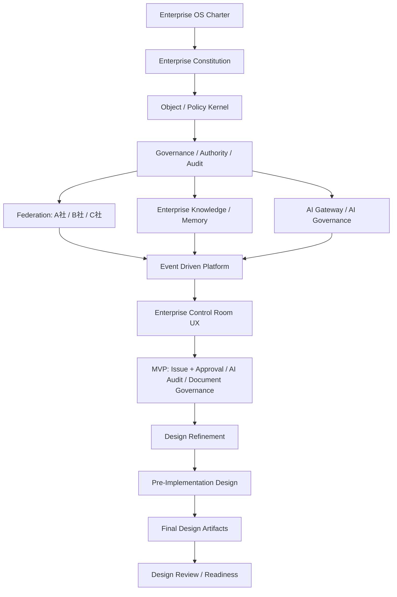

# AI Native Enterprise OS Blueprint

## 目的

この `docs` は、AI統制型 Enterprise Operating Platform を単なる業務SaaSやGitHub cloneではなく、Federation型の **AI Native Enterprise Operating System** として設計するための Blueprint です。

## 設計原則

| 原則 | 意味 |
|---|---|
| Governance First | 機能より統制を先に設計する |
| Federation Native | A社/B社/C社を統合せず、連邦として協調させる |
| AI Native | AI利用を例外機能ではなくOS基盤として扱う |
| Auditability | 人・Workflow・AI・Federation操作を監査可能にする |
| Explainability | AI判断の根拠を人間が追跡できるようにする |
| Knowledge Centered | Enterprise Memoryを意思決定の中心に置く |
| Policy Based | すべての重要操作をPolicyで制御する |
| Event Driven | 企業活動をEventとして連鎖・監査・再利用する |

## 全体構造



## フェーズ

| Phase | 領域 | フォルダ |
|---:|---|---|
| 0.5 | Object / Policy Kernel | `00_Object_Policy_Kernel` |
| 1 | Constitution | `01_Constitution` |
| 2 | Federation | `02_Federation` |
| 3 | Enterprise Knowledge | `03_Enterprise_Knowledge` |
| 4 | AI Governance | `04_AI_Governance` |
| 5 | Platform | `05_Platform` |
| 6 | UX / UI | `06_UX_UI` |
| 7 | MVP | `07_MVP` |
| 8 | Design Scenarios | `08_Design_Scenarios` |
| 9 | Design Refinement | `09_Design_Refinement` |
| 10 | Pre-Implementation Design | `10_Pre_Implementation_Design` |
| 11 | Final Design Artifacts | `11_Final_Design_Artifacts` |
| 12 | Design Review / Readiness | `12_Design_Review_Readiness` |

## 設計補助文書

| 文書 | 目的 |
|---|---|
| `DOCUMENTATION_MAP.md` | 文書間の依存関係と読み順を示す |
| `DESIGN_COMPLETION_GATE.md` | コーディング前の設計完了条件を定義する |
| `_origin/INDEX.md` | 構想初期の原典ノート群と正式設計の対応表 |

## アーカイブ

| フォルダ | 内容 |
|---|---|
| `_origin/` | 構想初期に作成された原典ノート（Vision / Phase 別ナラティブ）。設計動機・思想の参照用。設計仕様の正本は `00_Object_Policy_Kernel/` 〜 `12_Design_Review_Readiness/` 配下を参照する。 |

## 現在の設計段階

```text
Status: Coding Start Ready, Pending User Approval
Coding: Not Yet
Focus: User Approval -> Sprint 0 Implementation
```
