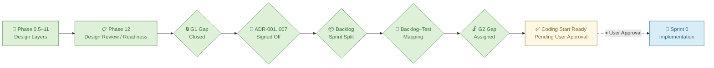
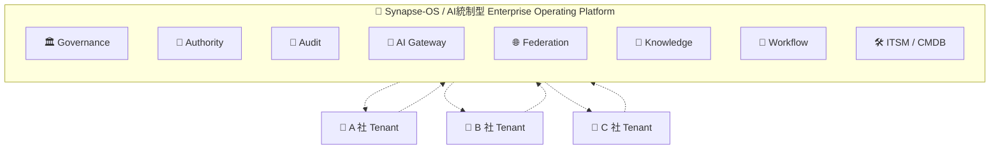
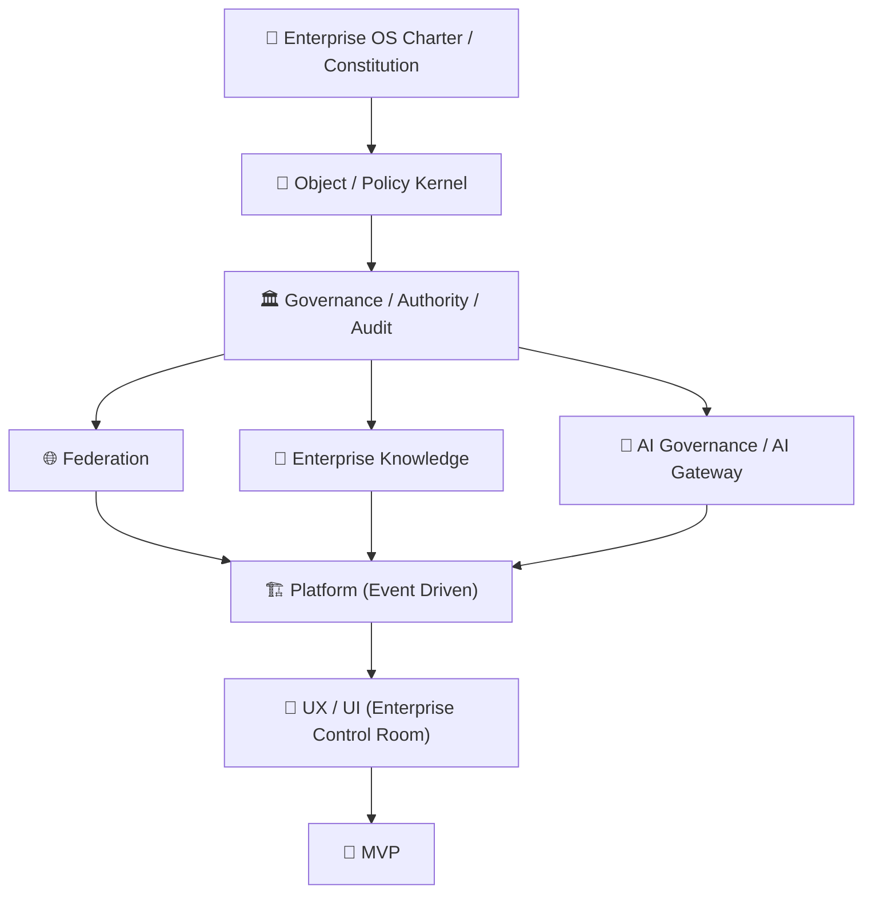
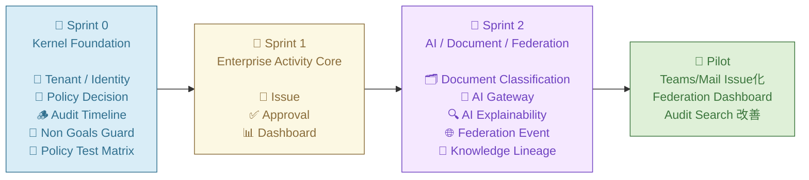
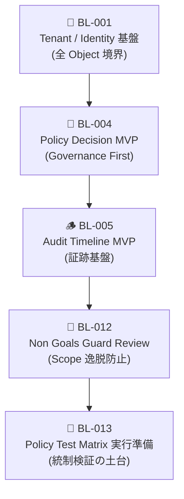
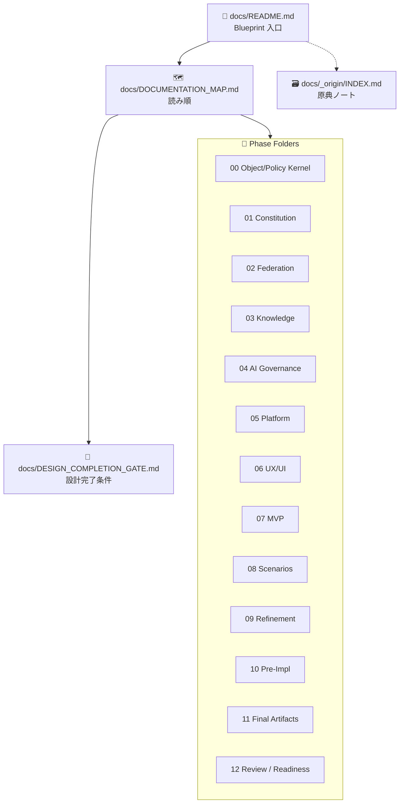
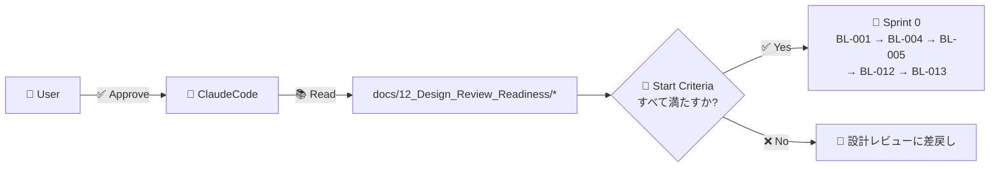
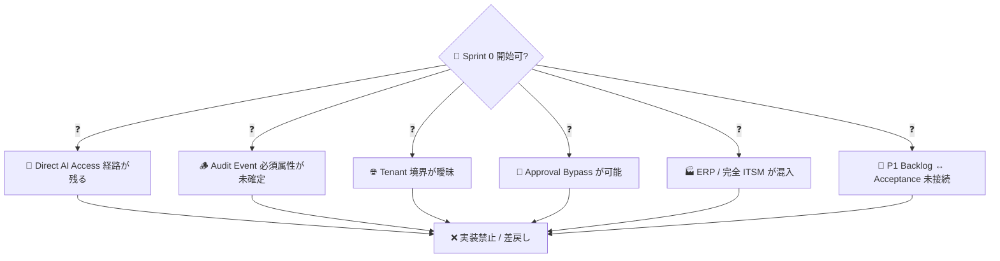

# 🧠 Synapse-OS

### 🏛 AI統制型 Enterprise Operating Platform

> 🌍 **A 社 / B 社 / C 社を Federation 連携する AI Native Enterprise Operating System**  
> 🚫 ERP・ITSM・GitHub・Workflow・Document・Audit・AI Governance を「機能の足し算」ではなく  
> ✅ **企業活動そのものを統制する OS** として再設計するプロジェクト。

---

## 🏷 Status — Sprint 13 セキュリティ CVE 解消 🔐 | 全6 Governance Gates G1–G6 ✅ COMPLETE | リリース目標 2026-12-20 Pilot RC 📊

> 📅 **2026-06-17 セッション更新**: Sprint 13 🔐 **CVE 解消完了** — starlette / PyJWT / python-multipart の脆弱性をトランジティブ依存の下限バウンド引き上げで解消。pip-audit: **0 脆弱性** 確認済み。
>
> - 🔐 **Sprint 13 CVE Fix (Issue #34)**: `fastapi>=0.116` で starlette→1.3.1 / `PyJWT>=2.13.0` / `python-multipart>=0.0.31` 全9サービス対応 (PR #35)
> - 🧪 **Sprint 11**: vitest ブランチカバレッジ計測 + HTTP セキュリティヘッダー / sameSite=Strict (PR #30)
> - 🌐 **Sprint 12**: CORS オリジン 環境変数化 `ALLOWED_ORIGINS` (PR #33)
> - ✅ **Sprint 10**: Frontend テスト整備 (#23) + 本番デプロイ手順書 (#24) + Next.js 15 upgrade (#25) (PR #26)
> - ✅ **本番デプロイ手順書**: `docs/deployment/PRODUCTION_DEPLOY.md` 完成 (`deploy.ready=true`)  
>   🎯 **リリース目標**: 2026-12-20「Synapse-OS Pilot Release / Production RC」— 全 Governance Gate 達成・CVE 0・本番デプロイ準備完了。

### ✅ 実装ステータス サマリ

| 🏷 領域                                         | 状態                  | 補足                                                                                                |
| ----------------------------------------------- | --------------------- | --------------------------------------------------------------------------------------------------- |
| 🧱 Sprint 0 (BL-001/004/005/012/013)            | ✅ 完了               | Tenant・Policy・Audit・Non-Goals Guard・Test Matrix                                                 |
| 🏢 Sprint 1 (BL-002/003)                        | ✅ 完了               | Issue / Approval Object + Sprint1 Acceptance Test                                                   |
| 🤖 Sprint 2 (BL-006..011)                       | ✅ 完了               | AI Action / Document / Federation / Knowledge MVP                                                   |
| 🚀 MVP RC (Docker + Frontend + E2E)             | ✅ merged             | PR #4 — main 統合済み                                                                               |
| 🏛 Sprint 3 — Governance Kernel                 | ✅ **merged**         | PR #5 main マージ済み ✅                                                                            |
| 📊 Sprint 4 — Federation Observability          | ✅ **merged**         | PR #9 main マージ済み ✅                                                                            |
| 🚀 Sprint 5 — CI Hardening & Policy Propagation | ✅ **merged**         | PR #10 main マージ済み ✅                                                                           |
| 🗄 Sprint 6 — G3 DB Migration                   | ✅ **merged**         | PR #12 main マージ済み — DATABASE_URL+Dockerfile+Alembic ✅                                         |
| 🌐 Sprint 7 — G4 Federation Demo                | ✅ **merged**         | 3社間デモシナリオ + frontend schema fix (+20 tests) — PR #14 main マージ済み ✅                     |
| 🔐 Sprint 8 — G5 Frontend Auth + Dashboard      | ✅ **merged**         | JWT auth + Dashboard auto-refresh + CI Docker fix — PR #17/#18 main マージ済み ✅                   |
| 🛡 Sprint 9 — G5+G6 Governance + Security       | ✅ **merged**         | PR #22 main マージ済み — G5 (AI直接アクセスCI) + G6 (監査ExportCSV/JSON) ✅                         |
| 🚀 Sprint 10 — 品質強化 + デプロイ準備          | ✅ **merged**         | Frontend テスト整備 (#23) + 本番デプロイ手順書 (#24) + Next.js 15 upgrade (#25) — PR #26 マージ済み |
| 🧪 Sprint 11 — vitest + セキュリティヘッダー    | ✅ **merged**         | vitest ブランチカバレッジ (#28) + HTTP headers / sameSite=Strict (#29) — PR #30 マージ待ち          |
| 🌐 Sprint 12 — CORS 設定強化                    | ✅ **merged**         | CORS オリジン環境変数化 ALLOWED_ORIGINS (#31) — PR #33 マージ待ち                                   |
| 🔐 Sprint 13 — CVE 解消                         | 🟣 **PR #35 open**    | starlette/PyJWT/python-multipart CVE fix (#34) — pip-audit 0 vulns ✅                               |
| 🧪 Test Suite                                   | ✅ **396 / 396 PASS** | + 32 vitest PASS / warnings 0 ✅                                                                    |
| 🔍 Static Analysis                              | ✅ Clean              | ruff 0 errors / bandit Medium+ 0 / pip-audit 0 vulns (Sprint 13 CVE fix 済み)                       |
| ⚙️ CI Pipeline                                  | ✅ Green              | 6 jobs: lint/test/frontend-build/docker-smoke/test-postgres/security                                |
| 🖥 Frontend (`web/`)                            | ✅ 完了               | Next.js 15 App Router、全 7 画面 API 疎通済み                                                       |
| 🐳 Docker                                       | ✅ 強化済み           | `restart: unless-stopped` 全11サービス / `docker compose up --build` で起動                         |

```mermaid
flowchart LR
    S0["🧱 Sprint 0<br/>Kernel Foundation<br/>✅ Done"] --> S1["🏢 Sprint 1<br/>Issue→Approval→Audit<br/>✅ Done"]
    S1 --> S2["🤖 Sprint 2<br/>AI / Federation / Knowledge<br/>✅ Done"]
    S2 --> RC["🚀 MVP RC<br/>E2E / Docker / Frontend<br/>✅ Merged"]
    RC --> S3["🏛 Sprint 3<br/>Governance Kernel<br/>✅ Merged"]
    S3 --> S4["📊 Sprint 4<br/>Federation Observability<br/>✅ Merged"]
    S4 --> S5["🚀 Sprint 5<br/>CI強化 + Policy Propagation<br/>✅ Merged"]
    S5 --> S6["🗄 Sprint 6<br/>G3 DB Migration<br/>✅ Merged"]
    S6 --> S7["🌐 Sprint 7<br/>G4 Federation Demo<br/>✅ Merged"]
    S7 --> S8["🔐 Sprint 8<br/>G5 Frontend Auth + Dashboard<br/>✅ Merged"]
    S8 --> S9["🛡 Sprint 9<br/>G5+G6 Governance Gates<br/>✅ Merged (PR #22)"]
    S9 --> S10["🚀 Sprint 10<br/>品質強化 + デプロイ準備<br/>✅ Merged (PR #26)"]
    S10 --> S11["🧪 Sprint 11<br/>vitest + セキュリティヘッダー<br/>✅ PR #30"]
    S11 --> S12["🌐 Sprint 12<br/>CORS 設定強化<br/>✅ PR #33"]
    S12 --> S13["🔐 Sprint 13<br/>CVE 解消 (pip-audit 0)<br/>🟣 PR #35 open"]
    classDef done fill:#dff0d8,stroke:#3c763d,color:#3c763d;
    classDef rc fill:#d9edf7,stroke:#31708f,color:#31708f;
    classDef live fill:#fcf8e3,stroke:#8a6d3b,color:#8a6d3b;
    classDef wip fill:#fff3cd,stroke:#856404,color:#856404;
    classDef next fill:#e8d5f5,stroke:#6f42c1,color:#6f42c1;
    class S0,S1,S2,RC,S3,S4,S5,S6,S7,S8,S9,S10,S11,S12 done;
    class S13 next;
```



### 🔐 Sprint 8 G5 — Frontend Auth + Dashboard 着手項目 (2026-05-27)

| 🎯 機能                         | 説明                                                                                               | Issue / PR |
| ------------------------------- | -------------------------------------------------------------------------------------------------- | ---------- |
| 🔑 JWT ログイン画面             | `web/app/login/page.tsx` — Email/Password フォーム + Loading + Error 表示                          | #15        |
| 🍪 httpOnly Session Cookie      | `web/lib/session.ts` + `app/api/auth/login`,`logout` Route Handler で sameSite=lax / secure (prod) | #15        |
| 🛡 Edge Middleware              | `web/middleware.ts` — `/login`, `/api/auth/*` を除き全経路で token 必須                            | #15        |
| 👤 Server Component で /auth/me | `web/app/layout.tsx` async 化、cookie → Bearer → /auth/me 取得                                     | #15        |
| 🚪 Sidebar Logout               | `web/components/Sidebar.tsx` — ユーザー名 / tenant 表示 + Logout ボタン                            | #15        |
| 📊 Dashboard 状態化             | KPI 384 tests / G5 In Progress / Sprint 6+7+8 進捗テーブル / Architecture 図に JWT Auth 追記       | #16        |
| 🔒 Open Redirect 修正 (Medium)  | `safeNextPath()` — 同一オリジン相対パスのみ許可。`//evil.com` などスキーム省略型もブロック         | #15        |
| 🧪 Test Suite                   | 既存 384/384 PASS 維持。CI 結果による N=3 を STABLE 判定基準とする                                 | —          |

```mermaid
sequenceDiagram
    autonumber
    participant Browser
    participant Next as Next.js (Edge)
    participant Route as /api/auth/login (Route Handler)
    participant Auth as tenant-identity-service
    Browser->>Next: GET / (no cookie)
    Next->>Browser: 307 → /login?next=/
    Browser->>Route: POST /api/auth/login {username,password}
    Route->>Auth: POST /auth/token (OAuth2PasswordRequestForm)
    Auth-->>Route: { access_token, token_type: bearer }
    Route-->>Browser: Set-Cookie session=<jwt>; HttpOnly; SameSite=Lax
    Browser->>Next: GET / (cookie attached)
    Next->>Auth: GET /auth/me (Authorization: Bearer <jwt>)
    Auth-->>Next: { username, tenant_id, role }
    Next-->>Browser: Sidebar + Dashboard (Server Rendered)
```

### 🌐 Sprint 7 G4 — Federation Demo 達成項目 (2026-05-27)

| 🎯 機能                            | 説明                                                                                                  |
| ---------------------------------- | ----------------------------------------------------------------------------------------------------- |
| 🌐 GET /federation-demo/scenario   | 3社間デモシナリオ静的エンドポイント (ADR-002 準拠: read-only)                                         |
| 🏢 A→B: APPROVED                   | L3_REGULATED trust + shared audit boundary                                                            |
| 🚫 A→C: BLOCKED                    | L1_INTERNAL trust 不足 + source_only audit boundary (プライバシー保護)                                |
| ⏳ B→C: REVIEW_REQUIRED            | L2_PARTNER / Federation Council 双方承認待ち                                                          |
| 🖥 Frontend FederationEvent 型修正 | `source_tenant_id` → `source_tenant` / `dlp_triggered` 削除                                           |
| 🎨 StatusBadge / SummaryStats      | APPROVED/REVIEW_REQUIRED/BLOCKED カード + テーブル表示                                                |
| 🔧 object-service 204 fix          | FastAPI 0.115.0 `response_model=None` 対応                                                            |
| 🔧 workflow-service 422 fix        | `HTTP_422_UNPROCESSABLE_CONTENT` → `HTTP_422_UNPROCESSABLE_ENTITY`                                    |
| 🧪 test_federation_demo.py         | 20 tests — field names / ADR-002 / audit_boundary / statuses / trust_level / risk_score / idempotency |
| ✅ STABLE N=3                      | CI 3 連続成功 (run #26508306977/26508310254/26508492247)                                              |

### 🛡 Sprint 9 G5+G6 — Governance Gates 完了 (2026-06-06) ✅

| 🎯 機能                          | 説明                                                                             | Issue |
| -------------------------------- | -------------------------------------------------------------------------------- | ----- |
| 🔍 G5: AI Direct Access CI 強制  | `tests/governance/test_no_direct_ai_access.py` — AST静的解析 (ADR-001)           | #19   |
| 📋 G6: 監査証跡エクスポート      | `GET /audit-events/export?format=csv\|json` — 7フィールド ISO/J-SOX 対応         | #20   |
| 🔐 npm audit GHSA-5j98 修正      | `web/package.json` overrides.glob=^10.5.0 — high 4→1 (残1件: next@14.x Accepted) | #21   |
| 🐳 Docker restart:unless-stopped | 全11サービスに自動再起動設定                                                     | #21   |
| 🚀 本番デプロイ手順書            | `docs/deployment/PRODUCTION_DEPLOY.md` — `deploy.ready=true`                     | #24   |

### 📊 最新セッション結果 (2026-06-06)

| 🔢 指標                 | 値                                                                          |
| ----------------------- | --------------------------------------------------------------------------- |
| 🧪 Test Pass Rate       | **396 / 396 (100.0%)** ✅                                                   |
| 🔁 新規追加テスト       | **+12 テスト** (G5×2 + G6×10)                                               |
| ⚠️ Deprecation Warnings | **0**                                                                       |
| 🔒 静的解析             | ruff Clean / bandit Medium+ 0 / pip-audit 0 vulns                           |
| 📊 STABLE               | **N=4 達成** ✅ CI 連続成功 4 回 (target N=3 超過)                          |
| 🏛 Governance Gates     | **G1–G6 全6門 完了** ✅                                                     |
| 📝 Sprint 9 PR          | [PR #22](https://github.com/Kensan196948G/Synapse-OS/pull/22) **MERGED** ✅ |
| 🚀 デプロイ準備         | `deploy.ready=true` / `docs/deployment/PRODUCTION_DEPLOY.md`                |

---

### 📊 Sprint 5 — CI Hardening & Policy Propagation 達成項目

| 🎯 機能                     | 説明                                                                                      |
| --------------------------- | ----------------------------------------------------------------------------------------- |
| ⚙️ frontend-build CI        | `.github/workflows/ci.yml` — Next.js npm build + ESLint ジョブ追加                        |
| 🐳 docker-smoke CI          | audit service healthcheck — Docker Buildx + curl smoke test ジョブ追加                    |
| 🏥 Docker healthcheck 修正  | 全8Pythonサービス `httpx` → `urllib.request` (stdlib) に変更                              |
| 🌐 Policy Propagation Tests | federation-service 13件追加 — risk_score / policy_result_ref / reasoning_summary 伝播確認 |
| 🧪 Governance E2E Tests     | 3フロー9件 — Audit Hash Chain / Federation ↔ Audit / AI Gateway ↔ Audit 連鎖検証          |
| 🔗 AuditEventType enum 修正 | 7値追加 — AIInvoked/AIBlocked/AIMasked/FederationBlocked など                             |
| ✅ Issue #7 クローズ        | `/dashboard/governance-metrics` — Sprint4時点で全受入れ条件達成済みを確認                 |
| ✅ Issue #8 クローズ        | Sprint3 tdd_required 4ファイル — 57件テスト全PASS (個別実行で conftest干渉なし確認)       |

### 📊 直近セッション結果 (2026-05-19)

| 🔢 指標                 | 値                                                                                                                                                                                                              |
| ----------------------- | --------------------------------------------------------------------------------------------------------------------------------------------------------------------------------------------------------------- |
| 🧪 Test Pass Rate       | **350 / 350 (100.0%)** ✅ STABLE N=3                                                                                                                                                                            |
| 🔁 新規追加テスト       | **+22 テスト** (Policy Propagation:13 / Governance E2E:9)                                                                                                                                                       |
| ⚠️ Deprecation Warnings | **0**                                                                                                                                                                                                           |
| 🛠 修正                 | AuditEventType enum 7値追加 / docker healthcheck stdlib化                                                                                                                                                       |
| 🔒 静的解析             | ruff Clean / bandit Medium+ 0 / pip-audit 0 vulns                                                                                                                                                               |
| 🏛 STABLE 判定          | ✅ **STABLE N=3 達成** (normal change criterion — Sprint 5)                                                                                                                                                     |
| 📝 Open PRs             | [PR #5](https://github.com/Kensan196948G/Synapse-OS/pull/5) / [PR #9](https://github.com/Kensan196948G/Synapse-OS/pull/9) / [PR #10](https://github.com/Kensan196948G/Synapse-OS/pull/10) — 人間 CTO merge 待ち |

---

## 🗺 リリースロードマップ — 2026-12-20 Pilot RC 目標

| 📅 期間           | 🎯 フェーズ                | 主要成果                                                        |
| ----------------- | -------------------------- | --------------------------------------------------------------- |
| 2026-05-19〜05-31 | **Stabilize Current**      | PR #5/#9/#10 統合・Issue #6-#8 完了 ✅・CI/README/state 整合    |
| 2026-06           | **Sprint 6: DB Migration** | SQLite → Pilot 永続 DB 移行 (G3) / A/B/C 社 Federation デモ準備 |
| 2026-07           | **Federation Core**        | A/B/C 社 trust model・Policy propagation・cross-tenant audit    |
| 2026-08           | **Enterprise Objects**     | Document / Knowledge / Workflow / Approval 拡張                 |
| 2026-09           | **AI Governance**          | DLP・model routing・prompt audit・explainability・AI policy     |
| 2026-10           | **Control Room**           | 管理コンソール・Audit Search・Policy Matrix・運用可視化         |
| 2026-11           | **Pilot Hardening**        | Security・OIDC方針・本番DB・backup・監査証跡・負荷試験          |
| 2026-12-01〜12    | **RC Freeze**              | 新機能凍結・バグ修正・回帰試験・運用手順完成                    |
| 2026-12-20        | **🚀 Pilot Release**       | Production RC / Pilot リリース判定                              |

### ⚠️ リリースゲート条件 (2026-12-20)

| #   | ゲート条件                                              | 現状                                                                                |
| --- | ------------------------------------------------------- | ----------------------------------------------------------------------------------- | ---------------------- |
| G1  | CI: frontend build + docker smoke + e2e 必須化          | ✅ Sprint 5 完了 (PR #10)                                                           |
| G2  | PR #5 → #9 順番統合・積み上げ解消                       | ✅ Sprint 6 完了 (PR #5/#9/#10 main マージ済み)                                     |
| G3  | SQLite → Pilot 用永続 DB 方針移行                       | ✅ Sprint 6 完了 (DATABASE_URL + Dockerfile[postgres] + Alembic + lifespan init_db) |
| G4  | A/B/C 社 Federation deny/allow/approval_required 実デモ | ✅ Sprint 7 完了 (federation_demo API + 3社間シナリオ + PR #14)                     |
| G5  | Direct AI Access 禁止を CI で強制                       | ✅ Sprint 9 完了 (tests/governance/test_no_direct_ai_access.py — AST 静的解析)      |
| G6  | Audit evidence export                                   | ✅ Sprint 9 完了 (GET /audit-events/export?format=csv                               | json — ISO/J-SOX 対応) |
| G7  | 2026-12-01 以降 新機能凍結                              | 📅 未来                                                                             |

---

## 🐳 Docker 起動ガイド (MVP RC)

### クイックスタート

```bash
# 全サービス + フロントエンドをビルド & 起動
docker compose up --build

# バックグラウンドで起動
docker compose up --build -d

# ログ確認
docker compose logs -f

# 停止
docker compose down
```

### サービス一覧とポート

| 🏷 サービス          | ポート | 説明                       |
| -------------------- | ------ | -------------------------- |
| 🌐 `web` (Next.js)   | 3000   | Enterprise Control Room UI |
| 🔐 `tenant-identity` | 8001   | JWT 認証・テナント管理     |
| 📜 `policy`          | 8002   | Policy Decision Engine     |
| 🪵 `audit`           | 8003   | 不変監査タイムライン       |
| 📝 `object`          | 8004   | Issue / Object CRUD        |
| 🔁 `workflow`        | 8005   | 承認フロー                 |
| 🤖 `ai-gateway`      | 8006   | AI ガバナンスゲートウェイ  |
| 🌐 `federation`      | 8007   | クロステナント連携         |
| 🧠 `knowledge`       | 8008   | ナレッジ・系譜管理         |
| 📊 `dashboard`       | 8009   | 統合ダッシュボード         |

### 主要エンドポイント確認

```bash
# ヘルスチェック
curl http://localhost:8001/healthz   # tenant-identity
curl http://localhost:8004/healthz   # object-service

# JWT 認証 (dev credentials)
curl -X POST http://localhost:8001/auth/token \
  -d "username=admin@synapse.local&password=admin1234" \
  -H "Content-Type: application/x-www-form-urlencoded"

# フロントエンド
open http://localhost:3000
```

---

## 💻 ローカル開発ガイド

### 必要要件

- Python 3.11+ (`python --version`)
- Node.js 20+ (`node --version`)
- uv (`pip install uv`) または pip

### バックエンド（個別起動）

```bash
# 依存関係インストール（全サービス共通）
uv pip install -r requirements.txt   # または pip install -r requirements.txt

# 各サービスを個別起動（例: object-service）
cd services/object-service
uvicorn object_app.main:app --port 8004 --reload

# テスト実行
python -m pytest tests/ services/ -x -q
```

### 環境変数

| 変数                  | デフォルト                      | 説明                                                                                               |
| --------------------- | ------------------------------- | -------------------------------------------------------------------------------------------------- |
| `DATABASE_URL`        | _(未設定)_                      | PostgreSQL 接続 URL — 設定時は `SQLITE_DB` より優先 (例: `postgresql://user:pw@host:5432/synapse`) |
| `SQLITE_DB`           | `sqlite:///:memory:`            | SQLite DB パス — `DATABASE_URL` 未設定時のみ有効                                                   |
| `JWT_SECRET_KEY`      | `dev-secret-key-change-in-prod` | JWT 署名キー                                                                                       |
| `JWT_ALGORITHM`       | `HS256`                         | JWT アルゴリズム                                                                                   |
| `NEXT_PUBLIC_API_URL` | `http://localhost:8001`         | フロントエンド API ベース URL                                                                      |

### フロントエンド（Next.js）

```bash
cd web
npm install
npm run dev    # http://localhost:3000

# 型チェック
npm run tsc:check   # または npx tsc --noEmit

# ビルド確認
npm run build
```

### テスト構成

```
tests/
├── e2e/                    # E2E 統合テスト (5件)
│   └── test_mvp_rc_e2e.py  # Auth・CRUD・Cross-service フロー
├── smoke/                  # 疎通確認スイート (27件)
├── non_goals_guard/        # スコープ逸脱ガード
└── acceptance/             # Sprint 受入テスト
services/
└── */tests/                # サービス単体テスト
```

---

## 🚀 MVP RC 受入基準チェックリスト

| #   | 基準                                    | 状態                             |
| --- | --------------------------------------- | -------------------------------- |
| 1   | 全主要画面が正常動作                    | ✅ 7 画面 API 疎通済み           |
| 2   | API 疎通成功（サービス間通信）          | ✅ TestClient アダプタ経由で確認 |
| 3   | 認証認可正常（JWT ログイン → /auth/me） | ✅ E2E テストで検証              |
| 4   | DB CRUD 成功（Issue create/read）       | ✅ SQLite + E2E テストで検証     |
| 5   | CI 成功                                 | ✅ GitHub Actions 3 並列 Jobs    |
| 6   | Critical/High 脆弱性ゼロ                | ✅ bandit + pip-audit クリーン   |
| 7   | E2E テスト成功                          | ✅ 5 件すべて PASS               |
| 8   | README/運用手順完成                     | ✅ 本ドキュメント                |
| 9   | Docker 起動成功                         | ✅ `docker compose up --build`   |
| 10  | ローカル環境で再現可能                  | ✅ `python -m pytest` 262 PASS   |

---

## 🗂 (旧) 設計完了 → コーディング開始直前



| 🏷 項目         | 状態                                                              |
| --------------- | ----------------------------------------------------------------- |
| 🧭 Phase        | Design Review / Readiness 完了                                    |
| 🚦 Status       | **Coding Start Ready, Pending User Approval**                     |
| 🔒 G1 Gap       | Closed                                                            |
| 🔓 G2 Gap       | Assigned (Sprint 0 / Sprint 2)                                    |
| 📝 ADR          | Signed Off (ADR-001 〜 ADR-007)                                   |
| 📦 Backlog      | Sprint 0 / 1 / 2 分割完了                                         |
| 🧪 Test Mapping | Completed                                                         |
| 💻 Coding       | Not Started                                                       |
| 🐙 Repository   | `Synapse-OS`（未作成）                                            |
| ➡️ Next         | User Approval → Sprint 0 Implementation（🤖 ClaudeCode 引き継ぎ） |

---

## 🌍 Vision — Federation 型企業 OS



> 🎯 **思想**: 「統合」ではなく **連邦統制（Federation）**。各組織の独立性を維持したまま協調する。

---

## 🏛 アーキテクチャレイヤ



> 🧭 上から下へ「**法律 → 物理単位 → 統制 → 連邦 / 知識 / AI → 基盤 → UI → 検証**」の順に積み上げる。

---

## 🎯 設計原則（8 Principles）

| 🔖  | 原則                     | 意味                                                      |
| :-: | ------------------------ | --------------------------------------------------------- |
| 🏛  | **Governance First**     | 機能より統制を先に設計する                                |
| 🌐  | **Federation Native**    | 単一企業前提ではなく Federation 前提で設計する            |
| 🤖  | **AI Gateway Mandatory** | AI 利用は必ず AI Gateway を経由。Direct AI Access は禁止  |
| 📜  | **Auditability**         | 人・AI・Workflow・Federation すべての主体を監査可能にする |
| 🔍  | **Explainability**       | AI 判断の根拠を人間が追跡可能にする                       |
| 🧠  | **Knowledge Centered**   | Enterprise Memory を意思決定の中心に置く                  |
| 📐  | **Policy Based**         | 重要操作はすべて Policy Engine で制御する                 |
| ⚡  | **Event Driven**         | 企業活動は Event として連鎖・監査・再利用する             |

---

## 🚫 Non-Goals — 実装で持ち込まないもの

| ❌ Non-Goal                   | ⚠️ 理由                                    |
| ----------------------------- | ------------------------------------------ |
| 🐙 GitHub clone               | 目的は企業活動統制であって開発管理ではない |
| 🏭 ERP / 完全 ITSM 化         | 巨大モノリス化を避ける                     |
| 🤖 Direct AI Access 経路      | AI Gateway Mandatory 違反                  |
| 🚪 Approval Bypass            | Governance First 違反                      |
| 🏢 中央集権 Multi-Tenant 統合 | Federation 思想に反する                    |

---

## 🚀 Sprint Plan — 実装ロードマップ



### 🧱 Sprint 0: Kernel Foundation（最初の実装対象）



| 🔢 順 | 🆔 Backlog    | 📋 内容                          | 🎯 主目的                            |
| ----: | ------------- | -------------------------------- | ------------------------------------ |
|     1 | 🔐 **BL-001** | Tenant / Identity 基盤の最小設計 | すべての Object 境界を先に確定する   |
|     2 | 📜 **BL-004** | Policy Decision MVP              | Governance First を実装層に下ろす    |
|     3 | 🪵 **BL-005** | Audit Timeline MVP               | あらゆる重要操作の前に証跡基盤を置く |
|     4 | 🚧 **BL-012** | Non Goals Guard Review           | Scope 逸脱防止                       |
|     5 | 🧪 **BL-013** | Policy Test Matrix 実行準備      | 統制検証の土台                       |

#### 🔍 Sprint 0 の終端定義（実装着手前にユーザー合意が必要）

| ❓ 確認事項            | 内容                                                         |
| ---------------------- | ------------------------------------------------------------ |
| 🚧 BL-012 実装形態     | ガバナンス Review / Policy deny-rule / CI チェックのいずれか |
| 🧪 BL-013 終端線       | Runner / Fixtures / Matrix のどこまでを準備とするか          |
| 🖥 BL-001 UI スコープ  | API のみ / 最小読み取り画面の有無                            |
| 🪵 BL-005 受け入れ条件 | Sprint 0 ではスキーマ・API のみ、生成側は Sprint 1           |
| 🚫 Sprint 0 非対象     | CI/CD、コンテナ化、IaC、本番外部 IdP 接続 など               |

---

## 📚 ドキュメント — Source of Truth は `docs/`



### 📑 入口文書

| 📄 文書                                                               | 用途                         |
| --------------------------------------------------------------------- | ---------------------------- |
| 📘 [`docs/README.md`](docs/README.md)                                 | 設計 Blueprint の入口        |
| 🗺 [`docs/DOCUMENTATION_MAP.md`](docs/DOCUMENTATION_MAP.md)           | 文書間の依存関係と推奨読み順 |
| 🚦 [`docs/DESIGN_COMPLETION_GATE.md`](docs/DESIGN_COMPLETION_GATE.md) | コーディング前の設計完了条件 |
| 🗃 [`docs/_origin/INDEX.md`](docs/_origin/INDEX.md)                   | 構想初期の原典ノート（参考） |

### 📁 Phase フォルダ

| 📂 Phase | 領域                         | フォルダ                                                                  |
| -------: | ---------------------------- | ------------------------------------------------------------------------- |
|      0.5 | 🧩 Object / Policy Kernel    | [`docs/00_Object_Policy_Kernel/`](docs/00_Object_Policy_Kernel)           |
|        1 | 🏛 Constitution              | [`docs/01_Constitution/`](docs/01_Constitution)                           |
|        2 | 🌐 Federation                | [`docs/02_Federation/`](docs/02_Federation)                               |
|        3 | 🧠 Enterprise Knowledge      | [`docs/03_Enterprise_Knowledge/`](docs/03_Enterprise_Knowledge)           |
|        4 | 🤖 AI Governance             | [`docs/04_AI_Governance/`](docs/04_AI_Governance)                         |
|        5 | 🏗 Platform                  | [`docs/05_Platform/`](docs/05_Platform)                                   |
|        6 | 🎨 UX / UI                   | [`docs/06_UX_UI/`](docs/06_UX_UI)                                         |
|        7 | 🚀 MVP                       | [`docs/07_MVP/`](docs/07_MVP)                                             |
|        8 | 🎭 Design Scenarios          | [`docs/08_Design_Scenarios/`](docs/08_Design_Scenarios)                   |
|        9 | 🪞 Design Refinement         | [`docs/09_Design_Refinement/`](docs/09_Design_Refinement)                 |
|       10 | 🛠 Pre-Implementation Design | [`docs/10_Pre_Implementation_Design/`](docs/10_Pre_Implementation_Design) |
|       11 | 📐 Final Design Artifacts    | [`docs/11_Final_Design_Artifacts/`](docs/11_Final_Design_Artifacts)       |
|       12 | ✅ Design Review / Readiness | [`docs/12_Design_Review_Readiness/`](docs/12_Design_Review_Readiness)     |

---

## 🤝 ClaudeCode への引き継ぎ



### 📥 ClaudeCode が必ず読む文書

| 📄 文書                                                                                                   | 目的                   |
| --------------------------------------------------------------------------------------------------------- | ---------------------- |
| ✅ [`MVP_CODING_START_DECISION.md`](docs/12_Design_Review_Readiness/MVP_CODING_START_DECISION.md)         | 実装開始可否判定       |
| 📋 [`IMPLEMENTATION_START_CRITERIA.md`](docs/12_Design_Review_Readiness/IMPLEMENTATION_START_CRITERIA.md) | 実装開始条件と禁止条件 |
| 📦 [`P1_BACKLOG_SPRINT_SPLIT.md`](docs/12_Design_Review_Readiness/P1_BACKLOG_SPRINT_SPLIT.md)             | Sprint 0 / 1 / 2 分割  |
| 🧪 [`BACKLOG_TEST_MAPPING.md`](docs/12_Design_Review_Readiness/BACKLOG_TEST_MAPPING.md)                   | Backlog–Test 観点対応  |
| 🔓 [`G2_GAP_ASSIGNMENT.md`](docs/12_Design_Review_Readiness/G2_GAP_ASSIGNMENT.md)                         | G2 Gap の Sprint 割当  |
| 📝 [`ADR_SIGNOFF.md`](docs/12_Design_Review_Readiness/ADR_SIGNOFF.md)                                     | ADR 承認状態           |

---

## 🚦 実装開始してはいけない条件

> ⚠️ 下記が残存している場合、ClaudeCode は実装を開始せず **設計レビューへ差し戻す**。



| 🚫 条件                                       | ⚠️ 理由                   |
| --------------------------------------------- | ------------------------- |
| 🤖 Direct AI Access 経路が残る                | AI Gateway Mandatory 違反 |
| 🪵 Audit Event 必須属性が未確定               | 監査不能                  |
| 🌐 Tenant 境界が曖昧                          | Federation 崩壊           |
| 🚪 Approval Bypass が可能                     | Governance First 違反     |
| 🏭 MVP Scope に ERP / 完全 ITSM が混入        | 巨大化                    |
| 🔗 P1 Backlog が Acceptance Criteria と未接続 | 実装目的が曖昧            |

---

## 📂 リポジトリ構成

```
📦 Synapse-OS/
├── 📘 README.md                  # 本ファイル（プロジェクト入口）
└── 📚 docs/                      # 設計成果物（Source of Truth）
    ├── 📘 README.md              # 設計 Blueprint
    ├── 🗺 DOCUMENTATION_MAP.md   # 読み順
    ├── 🚦 DESIGN_COMPLETION_GATE.md
    ├── 🧩 00_Object_Policy_Kernel/
    ├── 🏛 01_Constitution/
    ├── 🌐 02_Federation/
    ├── 🧠 03_Enterprise_Knowledge/
    ├── 🤖 04_AI_Governance/
    ├── 🏗 05_Platform/
    ├── 🎨 06_UX_UI/
    ├── 🚀 07_MVP/
    ├── 🎭 08_Design_Scenarios/
    ├── 🪞 09_Design_Refinement/
    ├── 🛠 10_Pre_Implementation_Design/
    ├── 📐 11_Final_Design_Artifacts/
    ├── ✅ 12_Design_Review_Readiness/
    └── 🗃 _origin/               # 構想初期の原典ノート（参照用アーカイブ）
```

### 🆕 Sprint 0 開始時に追加されるトップレベル（予定）

| 📁 予定パス    | 用途                                                |
| -------------- | --------------------------------------------------- |
| 🧰 `services/` | Backend service 群（Tenant / Policy / Audit / ...） |
| 🖥 `web/`      | Frontend（Enterprise Control Room）                 |
| 🏗 `infra/`    | IaC・Compose・Helm（Sprint 0 では非対象）           |
| 🧪 `tests/`    | Policy Test Matrix / Contract / Acceptance          |

---

## 🛠 開発スタック候補

> 🎯 詳細は [`docs/05_Platform/PLATFORM_ARCHITECTURE.md`](docs/05_Platform/PLATFORM_ARCHITECTURE.md) と [`docs/04_AI_Governance/AI_GATEWAY_MODEL.md`](docs/04_AI_Governance/AI_GATEWAY_MODEL.md) を参照。Sprint 0 で実装範囲分のみ確定する。

| 🔧 領域       | 候補                         |
| ------------- | ---------------------------- |
| 🖥 Frontend   | Next.js                      |
| ⚙️ Backend    | FastAPI / Go                 |
| 🔁 Workflow   | Temporal                     |
| 📡 Event Bus  | Kafka / NATS                 |
| 🔐 Auth       | Keycloak                     |
| 📊 VectorDB   | Qdrant                       |
| 🕸 GraphDB    | Neo4j                        |
| 💾 Storage    | MinIO（S3 互換 / WORM 対応） |
| 🤖 AI Gateway | LiteLLM                      |

---

## ⚙️ リポジトリ作成手順（参考）

> 🐙 リポジトリ `Synapse-OS` は **未作成**。GitHub 上で作成した後、下記で初期化する。

```bash
# 🚀 初期コミット
git init
git add README.md docs/
git commit -m "Initial commit: design completion / coding start ready"
git branch -M main
git remote add origin git@github.com:<owner>/Synapse-OS.git
git push -u origin main
```

### 🛡 推奨設定

| ⚙️ 項目                   | 推奨値                                  |
| ------------------------- | --------------------------------------- |
| 👁 Visibility             | 🔒 Private                              |
| 🌿 Default branch         | `main`                                  |
| 🛡 Branch protection      | `main` 保護、PR 必須、レビュー 1 名以上 |
| ✅ Required status checks | Sprint 0 で CI 整備後に設定             |
| 📜 License                | 未定（Sprint 0 開始前に決定）           |

---

## 📜 ライセンス

📝 **未定**。Sprint 0 開始前にユーザーが決定する。

## 👤 メンテナ

🧑‍💼 **Ken Aritoh**（IT システム運用管理者）

---

> 🧠 本プロジェクトは「機能開発」ではなく **企業 OS 構築** を志向する。  
> 📚 Source of Truth は `docs/` 配下の正式設計であり、機能追加やリファクタリングを行うときも常に  
> 🏛 **Governance First** / 🌐 **Federation Native** / 🤖 **AI Gateway Mandatory** /  
> 📜 **Auditability** / 🔍 **Explainability**  
> の **5 原則** からの逸脱がないかをレビューすること。
